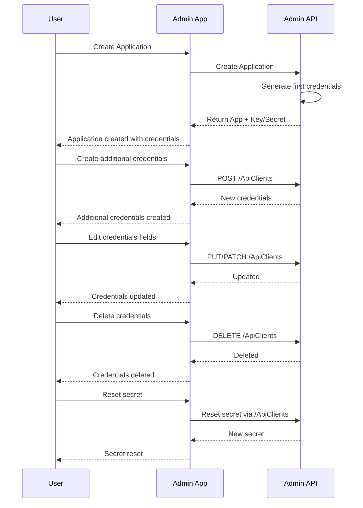

# Multiple credentials per Application

Admin Api (v2.3+) is able to support multiple credentials per Application using the Apiclients endpoint. But at this point Admin App does not support this, in other words for Admin App, an Application can only have 1 set of credentials.

## Admin Api perspective

From Admin Api perspective the flow works like this:

    1. The user creates an Application.
    2. Admin App creates the Application and generates the first set of credentials.
       1. The response from Admin Api includes the new key and secret to access Ods Api.
    3. The user can create additional credentials for the new Application using the ApiClient endpoint.
       1. With the same endpoint he can edit some of the credentials fields.
       2. He can delete the credentials and reset the secret as well.



### Credentials Management

#### Create

```
POST {{adminapi_url}}/v2/apiclients
{
  "name": "string",
  "isApproved": true,
  "applicationId": 0,
  "odsInstanceIds": [
    0
  ]
}
```

**Response** 201

#### Edit

```
PUT {{adminapi_url}}/v2/apiclients/{{id}}
{
  "name": "string",
  "isApproved": true,
  "applicationId": 0,
  "odsInstanceIds": [
    0
  ]
}
```

**Response** 200

#### Read All

```
GET {{adminapi_url}}/v2/apiclients
```

**Response** 200
```Sample response
[
  {
    "id": 0,
    "key": "string",
    "name": "string",
    "isApproved": true,
    "useSandbox": true,
    "sandboxType": 0,
    "applicationId": 0,
    "keyStatus": "string",
    "educationOrganizationIds": [
      0
    ],
    "odsInstanceIds": [
      0
    ]
  }
]
```

#### Read one

```
GET {{adminapi_url}}/v2/apiclients/{{id}}
```

**Response** 200
```Sample response
{
  "id": 0,
  "key": "string",
  "name": "string",
  "isApproved": true,
  "useSandbox": true,
  "sandboxType": 0,
  "applicationId": 0,
  "keyStatus": "string",
  "educationOrganizationIds": [
    0
  ],
  "odsInstanceIds": [
    0
  ]
}
```

#### Delete

```
DELETE {{adminapi_url}}/v2/apiclients/{{id}}
```

**Response** 200

#### Reset Credentials

```
PUT {{adminapi_url}}/v2/apiclients/{{id}}/reset-credential
```

**Response** 200

**Note** For testing purposes, you can run Admin Api and use this [file](https://github.com/Ed-Fi-Alliance-OSS/ODS-Admin-API/blob/main/docs/http/claimsets.http) to make requests and see the behavior.

## Admin App perspective

On Admin App we will need to make some changes to the Application page and we will need to add some new pages. To review these changes you can checkout the [AC-444](https://github.com/Ed-Fi-Alliance-OSS/Ed-Fi-AdminApp/tree/AC-444) branch and run the Admin App from there.

I won't add screenshots here because that might end up being confusing. The source of truth will be that branch. If at some point we need to make cosmetic changes or any other kind of changes, feel free to send a new commit to this branch.

### Pages and features

#### Create new Application credentials

[Application page](http://localhost:4200/as/1/sb-environments/2/edfi-tenants/2/applications/1)

Notice how at the top-right corner we now have a **Manage creds** button instead of **Reset creds** button. (The user won't be able to reset credentials at the **Application** level, he can now do it at the **ApiClient** level). When he clicks here, he'll be redirected to the **Application Credentials** page:

[Create Application credentials page](http://localhost:4200/as/1/sb-environments/2/edfi-tenants/2/applications/1/apiclients/create)

It's important to take into account that when the user creates an **Application**, a *default* set of credentials is created and returned as part of the response from the Admin Api.
So, although the reset button won't be on the **Application** page anymore, we need to keep the same functionality when the user creates the **Application**. This means that, when the user creates an Application and then he goes to list of credentials page, he will see 1 record.

#### List Application credentials

[ApiClients page](http://localhost:4200/as/1/sb-environments/2/edfi-tenants/2/applications/1/apiclients)

This page lists the Application credentials for the given Application. And it also includes a **New** button to redirect the user to the **New application credentials** page.

When the user click on the name, he is redirected to that specific Application Credentials page.

#### See single Application credentials

[ApiClient page](http://localhost:4200/as/1/sb-environments/2/edfi-tenants/2/applications/undefined/apiclients/1)

It shows the information for that specific set of Application credentials.

From here the user can: edit, delete or reset credentials.

#### Edit Application credentials

[ApiClient Edit page](http://localhost:4200/as/1/sb-environments/2/edfi-tenants/2/applications/1/apiclients/1?edit=true)

The fields the user can edit are: name, isApproved and ods instances. Notice that the **key**, **useSandbox** and **keyStatus** are ***readonly***

#### Delete Application credentials

From the single Application credentials page, the user can delete it as well.
Just follow the same patterns used in the application for other entity types, like showing a popup, etc.

#### Reset credentials

Resetting credentials is something that belongs now to the ApiClient, not to the Application. Before we remove this feature from the Application we need to move it/copy it, to the Application credentials page.

#### Disable reset credentials feature at the Application level

Once we have the reset credentials working at the ApiClient page and everything looks good, we can remove it from the Applications page.

## Other references

1. This [branch](https://github.com/Ed-Fi-Alliance-OSS/Ed-Fi-AdminApp/tree/AC-444) includes the UI changes to have as a reference.

## Implications

1. If the user wants this feature on Admin App, he will need to upgrade not only Admin App, but also Admin Api. For Admin Api he needs version 2.3+.
